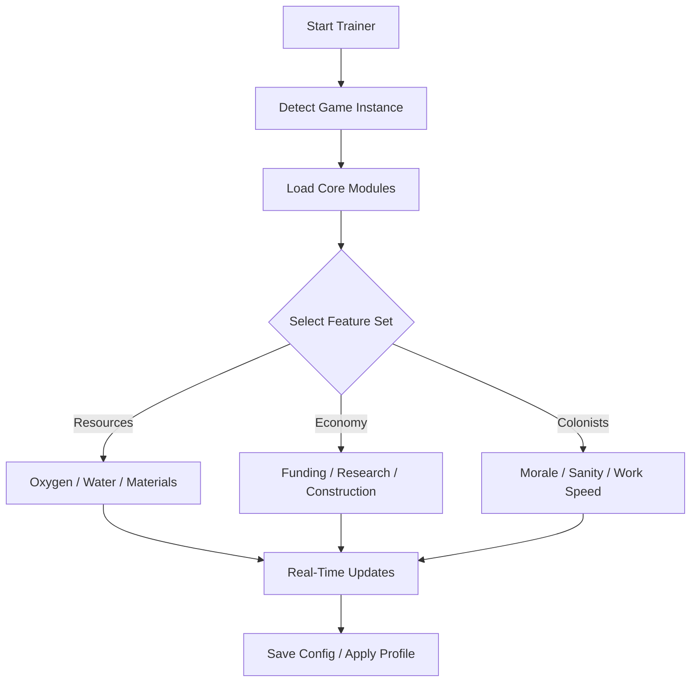

# Surviving Mars: Relaunched Trainer 🪐

The red planet is harsh, but you can master it. The **Surviving Mars: Relaunched Trainer** transforms your colony into a utopia of boundless productivity and perfect balance. From infinite oxygen to instant research, it’s your all-in-one control panel for life on Mars — no grind, no scarcity, just creative colonization.

---

## 🌌 Overview

In *Surviving Mars: Relaunched*, success is about precision and adaptability. This trainer was designed for both sandbox architects and survival strategists. With adjustable parameters for resources, construction, and colonist management, it allows you to test complex layouts, automate production, or simply enjoy a frictionless creative experience.


---

## ⚙️ Core Features

* **Infinite Resources:** Metals, polymers, concrete, food, and rare metals — never run out again.
* **Instant Construction:** Build domes and infrastructure with zero delay or materials.
* **Research Boost:** Max out science instantly or scale multipliers for realistic pacing.
* **Oxygen & Water Stability:** Maintain perfect environmental levels at all times.
* **Morale & Sanity Lock:** Keep colonists happy and productive under any condition.
* **Funding Editor:** Adjust budget dynamically for imports and expansion.
* **Weather & Disaster Control:** Disable dust storms, meteors, or cold snaps with one toggle.
* **Drone Efficiency Multiplier:** Supercharge your workforce for massive automation gains.

[!NOTE]

> The trainer functions safely in **offline or creative mode**. It does not alter cloud saves or multiplayer states.

---

## 🧩 Compatibility

| Platform         | Status | Notes                           |
| ---------------- | ------ | ------------------------------- |
| Windows 10       | ✅ Full | DX11 and DX12 builds supported  |
| Windows 11       | ✅ Full | Optimized overlay performance   |
| Steam            | ✅      | Auto-path detection             |
| Epic Games       | ⚠️     | Manual directory input required |
| Paradox Launcher | ✅      | Seamless integration tested     |

---

## ⚡ Quick Setup

1. Download and extract `SurvivingMars_Relaunched_Trainer.zip`.
2. Run as Administrator:

   ```bash
   SurvivingMars_Relaunched_Trainer.exe --init
   ```
3. Launch *Surviving Mars: Relaunched*.
4. Press **F6** to open the Trainer Overlay.
5. Enable desired modules or load a preset config (`creative.ini`, `colony_plus.ini`, `sandbox.ini`).

[!IMPORTANT]

> Start the trainer **before** opening the main menu to ensure smooth synchronization.

---

## 🪐 System Flow



---

## ⚒ Example Configurations

```ini
[creative_mode]
resources=infinite
funding=unlimited
construction=instant
morale=locked
weather=clear
research_speed=5.0

[survival_balance]
resources=balanced
funding=300000000
research_speed=1.5
drone_efficiency=2.0
morale_lock=false
```

Activate via shortcut:

```bash
mars --load creative_mode.ini
```

[!WARNING]

> Using instant construction during cutscenes may skip certain scripted events. Enable it only after initial tutorial phases.

---

## ❓ FAQ

**Q: Does the trainer modify my saves?**
A: No. All effects are runtime-based and reset after the session ends.

**Q: Can I use this in multiplayer or challenge modes?**
A: No. It’s strictly limited to solo or sandbox environments.

**Q: Will this disable achievements?**
A: Temporarily, yes. They’ll re-enable automatically when trainer features are off.

**Q: How do I restore default values?**
A: Use “Reset Defaults” in the overlay or run:

```bash
mars --reset
```

**Q: Can I adjust hotkeys?**
A: Yes. Edit `/config/hotkeys.json` for custom bindings.

---

## 🧠 Advanced Tools

* **Terraforming Control:** Directly adjust planetary parameters (temperature, water, atmosphere).
* **Population Manager:** Instantly generate or remove colonists for testing.
* **Supply Chain Editor:** Automate trade routes and cargo ship cycles.
* **Visual Enhancements:** Modify dust color, light bloom, or weather density for cinematic builds.

[!NOTE]

> Combine *Terraforming Control* and *Instant Construction* to create custom megadomes within minutes.

---

## 🌅 Final Thoughts

The **Surviving Mars: Relaunched Trainer** was made for visionaries — those who don’t just survive, but *shape* the red planet. Whether you’re experimenting with colony blueprints or engineering perfect self-sustaining cities, this tool gives you the means to rule Mars itself.

---

*Mars doesn’t forgive — but now, it obeys. The Surviving Mars: Relaunched Trainer gives you the tools to turn survival into supremacy.*
